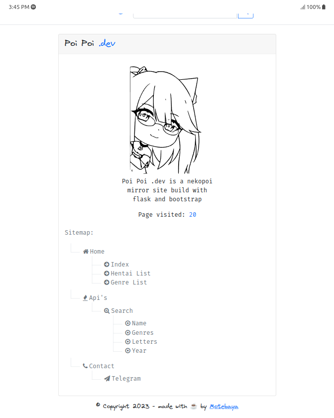
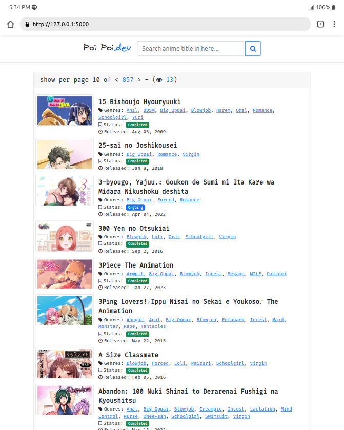
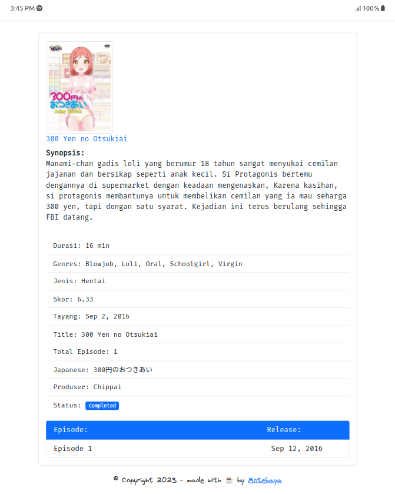
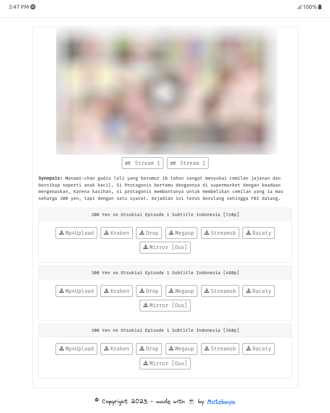

<div align='center'>
	<h4>Nekogitv2</h4>

---

<small>nekopoi site mirror and extractor</small>

[](https://www.python.org/downloads/release/python-3100/)
[](https://pypi.org/project/beautifulsoup4/)
[](https://pypi.org/project/Flask/)
[](https://palletsprojects.com/p/jinja/)
[](https://pypi.org/project/beautifulsoup4/)

</div>

### TODO

- [x] extract all hentai list.
- [x] download all images cover/thumbnails.
- [x] convert json SQlite3 database
- [ ] bypass redirect shortlink
- [x] pagination page
- [x] search by query

### Install This

```
git clone https://github.com/motebaya/nekogitv2
cd nekogitv2
python main.py --help
```

### Usage (CLI)

- `-e`, `--extract`: extract content list from index page, arg1: str [hentai, jav]
  ```
  python main.py -e hentai
  ```
- `-e`, `--database`: convert json data to SQlite3 database (.db), arg1: str [hentai, jav]
  ```
  python main.py -d hentai
  # this will create .db file in database folder.
  ```
- `i`, `--image`: download all minimum resolution covers/thumbnails image, arg1: str [hentai, jav]
  ```
  python main.py -i hentai
  ```

note: `more docs in source code.`

### Usage (web server)

- Setup database

  <div>

  1. Extract site using arg `-e hentai`, the result saved in [here](database/) as name `nekopoi.json`. see [example result](database#Json%20Result%20Example%3A).
  2. Download all covers/thumbnail images with arg `-i hentai `, all images saved in [here](database/hentai)
  3. Create SQlite3 database file from json file with arg `-d hentai`, this will generate result `hentaiList.db` in folder `database`. now all done.
  </div>

- Rename file `.env-example` to `.env`. fill the blank value, or using value in comment as default.
  ```
  PORT="<port>" # 5000
  HOST="<host>>" # 0.0.0.0
  # this necessary required for flash message
  FLASK_SECRET_KEY="<flask_key>" # flaskproject123
  DBPATH="<database_path>" # /root/database/hentaiList.db
  ```
- Run on local

  ```
  python index.py
  * Serving Flask app 'index'
  * Running on http://127.0.0.1:5000
  ```

  it's availabe for get all `jav_list` from index page, but too much different extended info for each of items. see it self by extract it with arg `-e jav`, it will save in same json database in key `jav_list`.

- Preview: generate with [chrome extension](https://chrome.google.com/webstore/detail/mobile-simulator-responsi/ckejmhbmlajgoklhgbapkiccekfoccmk/related)

  
  
  
  

## License

This project is licensed under the [MIT License](LICENSE).
