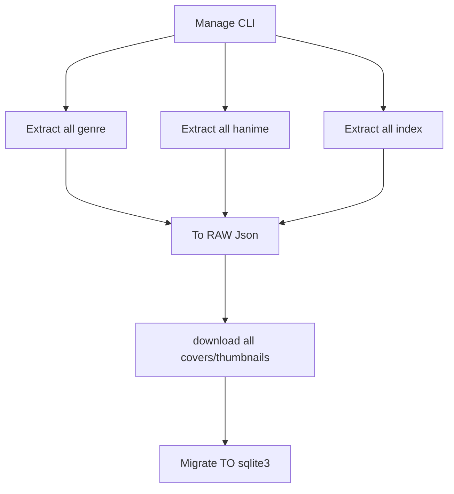

<div align='center'>
	<h3>Nekogitv2</h3>
<small>a nekopoi site mirror and extractor.</small>

[](https://www.python.org/downloads/release/python-3100/)
[](https://pypi.org/project/Flask/)
[](https://palletsprojects.com/p/jinja/)
[](https://pypi.org/project/beautifulsoup4/)

</div>

A mirror site built with Flask, Bootstrap, and other libraries. The web server is designed to have no direct interaction (_live scrape_) with the original website at all. Therefore, it will extract all _hanime_ content to JSON and convert it to an SQLite3 database.

Lets; see a simple flow:



> [!note]
> The project is just aimed at filling free time while learning about web scraping, bootstrap, and other libraries. No other intention like stealing and uploading it without the owner's permission!

### Setup

```
$ git clone https://github.com/motebaya/nekogitv2
$ cd nekogitv2
$ python3.10 -m pip install -r requirements.txt
$ python manage.py --help
```

### Usage (CLI)

- `-e`, `--extract`: extract content such as covers, thumbnails, index/list from site.
  you need extract `hanime-list` first before download all thumbnails/covers.

  ```
  python3.10 manage.py --extract hanime-list
  ```

- `-m`, `--migrate`: migrate a raw json database from _`app/models/database/hanime/Json/hanime-list.json`_ to sqlite3 database, default path (_`app/models/database/nekodata.db`_)

  ```bash
  python3.10 manage.py --migrate
  ```

### Usage (web server)

- see `.env` / `environment` file, feel free to change anything. e.g:

```
DEBUG=false
PORT="3000"
HOST="0.0.0.0"
FLASK_SECRET_KEY="this_is_secret123"
DBPATH="/root/custom/dbath.db"
```

- run index file:

```bash
$ python3.10 index.py
* Serving Flask app 'app.App'
* Debug mode: off
* Running on all addresses (0.0.0.0)
* Running on http://127.0.0.1:5000
Press CTRL+C to quit
```

> [!important]
> before run the web server, make sure you've set everything up via the CLI, like downloading all the covers/thumbnails and migrating the JSON to the SQLite3 database. The web server won't run until you've migrated it to the SQLite3 database.

## License

This project is licensed under the [MIT License](LICENSE).
