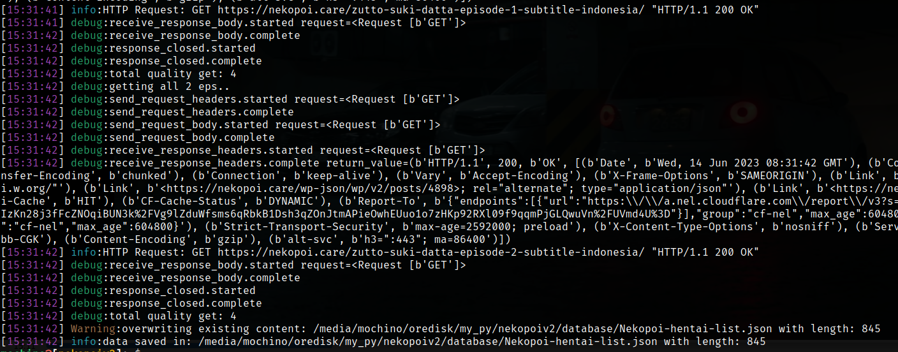
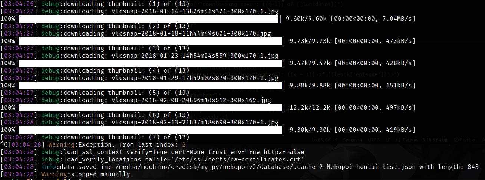
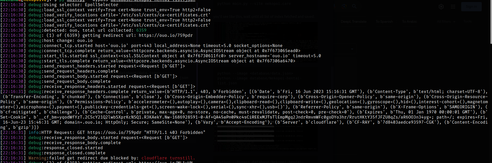

<div align='center'>
    <h4> Nekogitv2 </h4>
    <hr>
    <p> nekopoi scrapper and extractor v2</p>

[](https://www.python.org/downloads/release/python-3100/)
[](https://example.com)
[](https://github.com/motebaya/nekogitv2/stargazers)
[](https://github.com/motebaya/nekogitv2/network/members)

</div>

### Intro

- made with [python asynchronous](https://docs.python.org/3/library/asyncio.html)
- [httpx client](https://www.python-httpx.org/async/) for making async requests
- [aiohttp](https://docs.aiohttp.org/en/stable/) client for downloading images
- [aiofiles](https://pypi.org/project/aiofiles/) for saving image from request

Asynchronous allows to write code that can perform with multiple tasks concurrently without blocking the execution of other code.

It's very useful for I/O-bound operations, such as network requests or file operations, where waiting for the completion of one task should not prevent other tasks from executing.

### Todo

- [x] fetch all hanime list from index page
- [x] download all images cover and thumbnail
- [ ] bypass all shortlink download url

### Install this

```
git clone https://github.com/motebaya/nekogitv2
cd nekogitv2
python main.py
```

### CLI command

- `-s , --site` : extract all hanime by site host: [rajahentai.xyz, nekopoi.care]
- `-b , --bypass`: bypass redirect/shortlink url: [bokepku.xyz, ouo.io] from \*arg [file]
- `-i , --image`: fetch and download all cover/thumbnail image from \*arg [file]

### usage:

```
python main.py --site nekopoi.care
```

- you'il see like this, wait until all list of index fetched and saved.



```
python --image <database/data.json>
python --image database/Nekopoi-hentai-list.json
```

- this will downloading all images cover and thumbnail with **async** as i say before. see folder src/<thumbnail/cover> this is location for save all images.



```
python --bypass database/Nekopoi-hentai-list.json
```

- grep all ouo.io url from json string then bypass it... yah, this shouldy work , but the [cloudflare turnstill](https://www.cloudflare.com/products/turnstile/) always block the request. as you see in this image



### And then what?

- You can experiment with the scraped data, such as managing it in JSON format or converting it into SQL and creating your own mirror website.

## License

This project is licensed under the [MIT License](LICENSE).
